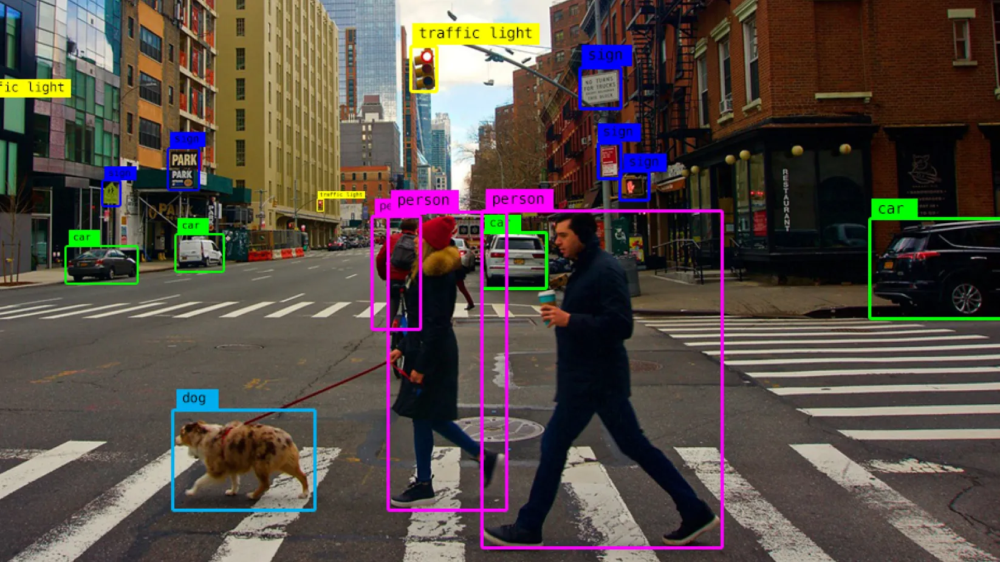

# 🎥 Real-Time Object Detection 👁️


## 🚀 Overview

This project implements real-time object detection using your webcam with OpenCV and MobileNet SSD. The application can identify and highlight various objects in your camera feed with bounding boxes and labels.

<p align="center">
  
</p>

## ✨ Features

- 📊 Real-time object detection through your webcam
- 🖼️ Bounding box visualization around detected objects
- 🏷️ Object classification with labels
- 🔍 Adjustable confidence threshold
- 🚀 Uses efficient MobileNet SSD model

## 🛠️ Requirements

- Python 3.6+
- OpenCV (`cv2`)
- NumPy
- Pre-trained model files:
  - `coco.names`: List of object classes
  - `ssd_mobilenet_v3_large_coco_2020_01_14.pbtxt`: Model configuration
  - `frozen_inference_graph.pb`: Model weights

## 📦 Installation

```bash
# Clone the repository
git clone https://github.com/yourusername/real-time-object-detection.git
cd real-time-object-detection

# Install required packages
pip install opencv-python numpy
```

## 🔧 Model Setup

1. Download the required model files:
   - `coco.names`: COCO dataset class names
   - `ssd_mobilenet_v3_large_coco_2020_01_14.pbtxt`: Model configuration
   - `frozen_inference_graph.pb`: Model weights

2. Place these files in the project root directory.

## 🚀 Usage

Run the main script to start object detection:

```bash
python object_detection.py
```

## 🎮 Controls

- **q**: Quit the application

## 🧪 Customization

You can customize the detection parameters by modifying these variables:

```python
# Set confidence threshold (0.0 to 1.0)
confThreshold = 0.6  

# Change input size for better performance or accuracy
net.setInputSize(320, 230)  # Smaller = faster, Larger = more accurate
```

## 🔍 How It Works

1. The webcam captures video frames
2. Each frame is processed by the MobileNet SSD neural network
3. The network detects objects and classifies them
4. Bounding boxes and labels are drawn around detected objects
5. The processed frame is displayed in real-time

## 🙏 Acknowledgments

- [OpenCV](https://opencv.org/) for the computer vision library
- [COCO Dataset](https://cocodataset.org/) for the object classes
- MobileNet SSD model for efficient object detection

---

Made with ❤️ by Aymane Elm
